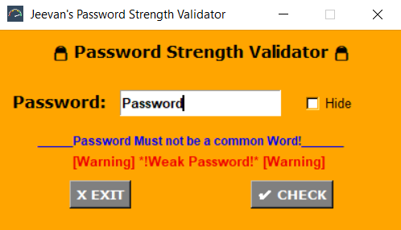

# Password-Strength-Validator

#### = > This is a Password Strength Validator built using `Regex` and `Tkinter` GUI.
#### = > This Validator is not a regualar Password validator we use this validator uses `20,000` commonly used passwords and words for evaluating your password.
### Imported Libraries
#### 1. `re`
#### 2. `Tkinter`
#### 3. `Pandas`

#### GUI Window

### Contribute

Pull requests are welcome. For major changes, please open an issue first to discuss what you would like to change.
